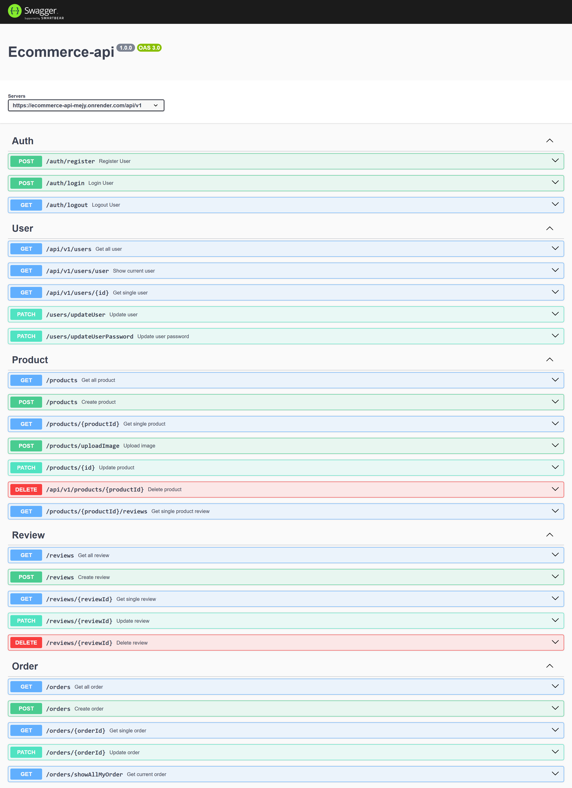

# E-commerce API

## Overview

RESTful API for e-commerce operations built with Node.js, Express, and MongoDB Mongoose.

[Live Documentation](https://ecommerce-api-mejy.onrender.com/api-docs)

## API Documentation

Swagger UI: `https://ecommerce-api-mejy.onrender.com/api-docs`

### Routes



## Tech Stack

- Node.js
- Express.js
- MongoDB
- Mongoose
- JSON Web Token (JWT)

## Prerequisites

- Node.js 16+
- MongoDB 5+
- npm

## Installation

### Clone Repository

```bash
git clone https://github.com/haileyesuschekol/ecommerce-api.git
cd ecommerce-api
```

### Install Dependencies

```bash
npm install
```

### Environment Configuration

Create `.env` file:

```
MONGODB_URI=mongodb://localhost:27017/ecommerce
JWT_SECRET=your_secret_key
JWT_LIFETIME=1d
```

## Running Application

### Development

```bash
node app.js
```

## RUN

- `port 8080`

## API Endpoints

### Authentication

- `POST /api/v1/auth/register`
- `POST /api/v1/auth/login`
- `GET /api/v1/auth/logout`

### User

- `GET /api/v1/user`
- `GET /api/v1/users/user`
- `GET /api/v1/user/{id}`
- `PATCH /api/v1/users/updateUser`
- `PATCH /api/v1/users/updateUserPassword`

### Products

- `GET /api/v1/products`
- `POST /api/v1//products`
- `GET /api/v1/products/{id}`
- `POST /api/v1/products/uploadImage`
- `PATCH /api/v1/products/{id}`
- `DELETE /api/v1/products/{id}`
- `GET /api/v1/{productsId}/reviews`

### Review

- `GET /api/v1/reviews`
- `POST /api/v1/reviews`
- `GET /api/v1/{reviewId}`
- `PATCH /api/v1/{reviewId}`
- `DELETE /api/orders/{reviewId}`

### Orders

- `GET /api/v1/orders`
- `POST /api/v1/orders/`
- `GET /api/v1/orders/{orderId}`
- `PATCH /api/v1/orders/{orderId}`
- `GET /api/v1/orders/showAllOrder`

## Database Models

- User
- Product
- Order
- Review

## Authentication

- JWT-based
- Role-based access control

## Testing

```bash
npm test
```

## Deployment

- render
